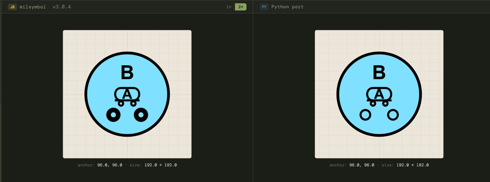

# milsymbol-py

[](https://github.com/klundeen/milsymbol-py/actions/workflows/tests.yml)
[](https://pypi.org/project/milsymbol/)

A reference implementation and test harness for porting
[milsymbol](https://github.com/spatialillusions/milsymbol) (JavaScript)
to Python — with a usable frozen renderer as a side effect.

Generates SVG military symbols per **MIL-STD-2525** (B/C/D/E) and
**STANAG APP-6** (B/D/E).

```python
from milsymbol import Symbol

sym = Symbol("10031000001211000000", size=80)   # friendly infantry
svg = sym.as_svg()                               # → SVG string

sym = Symbol("SHG-UCI----", size=80)             # hostile infantry
svg = sym.as_svg()
```

---

## The porting problem

Milsymbol is 33,000 lines of JavaScript. A naïve port — translate the
JS to Python line by line — is what most people attempt, and it tends
to fail. The codebase looks deceptively simple: one main class, a
handful of methods, clean SVG output. But ~27,000 of those lines are
**data** — hand-tuned SVG path coordinates for hundreds of military
symbol icons, each positioned to fit precisely inside affiliation-
specific frame shapes (rectangle for friendly, diamond for hostile,
quatrefoil for unknown, etc.). The remaining ~5,000 lines of logic
compose those icon parts based on a parsed SIDC code and render them
to SVG.

An LLM (or a mid-level engineer) can translate the 5,000 lines of
composition logic reasonably well. The problem is the 27,000 lines of
icon geometry. Every path coordinate matters. A misplaced decimal in a
single `d="M 85,140 30,0 c 0,-20 -30,-20 -30,0 z"` produces a
visually broken symbol, and you can't verify correctness without
domain expertise in the military standards.

## Our approach: extraction, not translation

Instead of translating code, we treat the JS library as an **oracle**:

1. **Extract at build time.** A Node.js tool runs the original
   milsymbol library and creates every valid symbol across all
   affiliations. For each one, it captures the fully-composed draw
   instruction tree (the intermediate representation milsymbol uses
   before SVG serialization) and the bounding box. This produces
   ~109,000 symbol variants serialized as gzipped JSON (~2 MB).

2. **Look up at runtime.** When `Symbol(sidc)` is called in Python,
   it does a dictionary lookup on the SIDC to get the pre-composed
   draw instructions and bounding box. No parsing, no composition
   logic, no icon geometry — just a key lookup.

3. **Render.** A compact Python renderer (~250 lines) walks the draw
   instruction tree and emits SVG markup, matching the JS output
   character-for-character.

The result: **pixel-identical SVG output** verified by exact string
comparison against the JS reference, with a Python codebase of ~400
lines instead of 33,000.

### What Phase 1 actually is

To be direct: this is not yet a port of milsymbol. It's three things:

1. **A test oracle.** 109K pre-computed reference symbols that any
   future port — Python, Rust, Go, whatever — can verify against,
   character by character. This is the hard part that didn't exist
   before.

2. **A frozen renderer.** It works today for every symbol in
   MIL-STD-2525E / APP-6 as of milsymbol 3.0.3. If you just need
   military symbols in Python and don't need extensibility, it's a
   perfectly functional library. But it's frozen at extraction time.

3. **Scaffolding for the real port.** The project structure, FastAPI
   comparison server, visual playground, and smoke tests. When
   someone ports the actual composition logic (Phase 2), all the
   verification infrastructure is already in place.

The extracted data approach **cannot** handle:

- **Runtime extensions** — milsymbol's `addSymbolPart()` /
  `addIconParts()` API lets users register custom symbology. The
  extracted data only covers built-in symbols.
- **Novel SIDC combinations** — modifier combinations not covered
  during extraction produce no output.

This is a deliberate tradeoff, not an oversight. Phase 2 — porting
the ~5,000 lines of composition logic — is dramatically easier
because Phase 1 exists. You port one function, run the full
comparison, and know immediately what broke.

### Analogy

Think of it as the difference between porting a compiler and shipping
pre-compiled object files. We ran the JS "compiler" on every valid
input at build time, shipped the results, and wrote a Python "linker"
to assemble them into SVG. The linker is trivial; the compiler port
comes later — and when it does, we already have the full test corpus.

### A note on process

This project was built in three sessions over two days (~10
hours) through conversation between Kevin Lundeen (a CS professor
at Seattle University) and Claude Opus 4.6. Kevin never read the
milsymbol JS source or the generated Python — he directed entirely
through architecture questions, visual inspection of playground
output, and quality standards. Claude read the 33,000-line
codebase, devised the extraction strategy, wrote all the code, and
built the test infrastructure.

The comment that inspired this project observed that LLMs fail at
tasks like porting JS libraries to Python. We didn't port the
library — we found a way around the problem entirely.

See [How this was built](#how-this-was-built) at the end of this
README for a detailed retrospective.

---

## Install

```bash
pip install milsymbol          # core library (no dependencies)
pip install milsymbol[server]  # adds FastAPI comparison server
```

Or from source:

```bash
git clone https://github.com/klundeen/milsymbol-py.git
cd milsymbol-py
uv sync --extra dev
uv run pytest
```

## API

### `Symbol(sidc, **kwargs)`

| Argument | Default | Description |
|---|---|---|
| `sidc` | *(required)* | SIDC string — number (20-digit) or letter format |
| `size` | `100` | Symbol size (scaling factor; 100 = base size) |
| `stroke_width` | `4` | Frame stroke width |
| `outline_width` | `0` | Outline width around the symbol |

### Methods

| Method | Returns | Description |
|---|---|---|
| `as_svg()` | `str` | Complete SVG markup |
| `is_valid()` | `bool` | Whether the SIDC resolved to a known symbol |
| `get_anchor()` | `dict` | `{"x": float, "y": float}` — placement anchor |
| `get_size()` | `dict` | `{"width": float, "height": float}` — rendered size |
| `get_metadata()` | `dict` | Parsed SIDC fields |

### Affiliations

Number SIDCs encode affiliation at position 3:

| Code | Affiliation | Frame |
|---|---|---|
| `3` | Friend | Rectangle (blue) |
| `6` | Hostile | Diamond (red) |
| `4` | Neutral | Square (green) |
| `1` | Unknown | Quatrefoil (yellow) |

Letter SIDCs encode affiliation at position 1 (`F`/`H`/`N`/`U`/etc.).

## Playground

A browser-based comparison tool shows JS and Python output side by
side. The render areas use a parchment background so the symbols'
black text labels are visible.

```bash
# Start the Python backend
pip install milsymbol[server]
uvicorn server:app --port 8000

# Serve the playground
cd playground && python -m http.server 3000
# Open http://localhost:3000/playground.html
```

## Coverage

| Category | Count |
|---|---|
| Number SIDCs (all affiliations) | 37,828 |
| Letter SIDCs (all affiliations + echelons) | 71,388 |
| Icon modifier overlays (m1/m2) | 5,936 |
| Symbol sets | 19 |
| Tests (fast) | 184 |
| Tests (full corpus, vs JS reference) | 403 |
| Corpus match rate | 109,216 / 109,216 (100%) |
| Icon modifier match rate | 7,105 / 7,130 (99.65%) |
| Python source lines | ~2,100 |
| Data (gzipped) | 2.1 MB |

## Can I use this in production?

Yes. The library produces **pixel-identical SVG** to the JS library
for all 109,216 base symbols in the MIL-STD-2525 / STANAG APP-6
set, verified by exact string comparison against JS-generated
reference SVGs. Every affiliation, every symbol set, every echelon.

Icon modifier overlays (SIDC positions 17-20) are supported with
99.65% exact match. The 25 known mismatches are a minor
stroke-width difference on one specific modifier combination — see
[Known mismatches](#known-mismatches) below.

**Caveats:**

- Frozen to milsymbol 3.0.4's built-in symbol set — no runtime
  extensions or custom icon registration.
- Icon modifier overlays, text fields, and structural modifiers
  are computed in Python. The core symbols are extracted from JS;
  the composition logic around them is ported.
- SVG output only (pipe through `cairosvg` for PNG if needed).

**Wheel size:** 1.8 MB, zero runtime dependencies.

## Upstream version

Pinned to **milsymbol 3.0.4**
([`b05f2d7`](https://github.com/spatialillusions/milsymbol/commit/b05f2d7)).
The playground checks for newer releases on load via the GitHub API
and displays a warning if the upstream has moved ahead.

The version pin is recorded in `pyproject.toml` under `[tool.milsymbol]`.

### Staying in sync

When the upstream JS library updates:

1. Clone the new version and build it:
   ```bash
   git clone https://github.com/spatialillusions/milsymbol.git
   cd milsymbol && npm install && npm run build
   ```
2. Re-run the extraction tools to regenerate data files:
   ```bash
   node tools/extract_data.mjs ./milsymbol ./milsymbol-py/milsymbol/data
   node tools/extract_modifiers.mjs ./milsymbol ./milsymbol-py/milsymbol/data
   ```
3. Re-generate the corpus reference from JS:
   ```bash
   node tools/gen_corpus_ref.mjs ./milsymbol ./milsymbol-py/milsymbol/data
   ```
4. Run the corpus test to see what changed:
   ```bash
   pytest tests/test_corpus.py -m slow -v
   ```
5. Update `playground/milsymbol.js` with the new build.

A future CI job could automate steps 1–4 on a schedule, opening a
PR when the upstream version changes.

## Development

```bash
git clone https://github.com/klundeen/milsymbol-py.git
cd milsymbol-py
uv sync --extra dev

uv run pytest                                              # 184 fast tests
uv run pytest -m slow                                      # + 403 corpus tests
uv run ruff check milsymbol/ tests/ server.py              # lint
uv run ruff format --check milsymbol/ tests/ server.py     # format check
uv run mypy milsymbol/ server.py --ignore-missing-imports  # type check
```

### CI/CD

Every push to `main` and every PR runs:
- **ruff** lint + format check
- **mypy** type checking
- **pytest** across Python 3.10, 3.11, 3.12, 3.13

Creating a GitHub Release triggers automatic publishing to PyPI via
trusted publishing.

### Publishing to PyPI

Published at [pypi.org/project/milsymbol](https://pypi.org/project/milsymbol/).
Creating a GitHub Release triggers automatic publishing via trusted
publishing.

## Known upstream quirks

These behaviors are inherited from the JS library and reproduced
faithfully by the Python port:

- **Quantity / echelon collision.** The quantity text field is
  positioned relative to the frame bounding box, not the full symbol
  including echelon dots. At larger sizes, quantity text can overlap
  the echelon modifier.

## Known mismatches

25 symbols produce SVGs that differ slightly from the JS reference.
All involve SS 15 (Land Equipment) entity 120100 (Armoured
Protected Vehicle) with m2 modifier code 07 (Wheeled Limited Cross
Country), across all 25 valid m1 codes (00–24).

The difference is `stroke-width` on the small wheel circles at the
bottom of the symbol. The JS library's `ms._scale` function
mutates `non_scaling_stroke` in place on shared icon-part cache
objects, which bleeds into the m2=07 overlay circles because entity
120100's main icon embeds a reference to the same wheel-circle
objects. This cache mutation is order-dependent and difficult to
reproduce without porting the full JS runtime cache semantics.

To see the difference, enter `10031500001201000107` in the
playground and compare the two small circles at the bottom — the
JS version renders them with slightly thicker strokes.



| Scenario | JS stroke-width | Python stroke-width |
|---|---|---|
| m1=00, m2=07 (scale 0.7) | 4.286 | 3 |
| m1=01–24, m2=07 (scale 0.45) | 6.667 | 3 |

The same pattern likely affects 8 other SS 15 entities that embed
the same wheel-circle icon parts (120000, 130000, 190000–190500),
though only entity 120100 was tested in the broad sweep.

## Changes in v0.2.0

**Bug fix: icon modifier codes (SIDC positions 17-20).** The
20-digit number SIDC encodes two independent icon modifier codes
at positions 17-18 (sector 1) and 19-20 (sector 2). These add
weapon types, equipment indicators, rank insignia, and capability
overlays to the base entity icon. In v0.1.0, any SIDC with
non-zero modifier codes returned a question mark — which meant
most real-world tactical symbols with weapons or equipment
designators didn't render. v0.2.0 extracts the modifier overlay
draw instructions separately (5,936 entries, 55 KB) and composes
them at runtime with the correct scaling transforms, matching the
JS output for 99.65% of tested combinations.

**Bug fix: SIDC status field fallback.** SIDCs with non-zero
status codes (position 6) now correctly fall back to the base
entity lookup. Previously, a damaged or destroyed symbol
(status=1 or 2) with modifier codes could fail to resolve.

## Roadmap

- [x] Extract test oracle (109K reference symbols)
- [x] Frozen renderer with exact SVG match
- [x] Visual comparison playground
- [x] Port text field placement (quantity, type, designation, etc.)
- [x] Port echelon / mobility / HQ / TF / feint-dummy modifiers
- [x] Comprehensive test fixture (109K symbols vs JS reference)
- [x] Port icon modifier overlays (m1/m2, SIDC positions 17-20)
- [ ] Port composition logic (Phase 2 — real port)
- [ ] Automated upstream sync (CI job to detect new milsymbol releases)
- [ ] Extension API
- [ ] PNG rasterization (via cairosvg or similar)

## License

MIT — same as the original
[milsymbol](https://github.com/spatialillusions/milsymbol) library.

## Credits

- **[milsymbol](https://github.com/spatialillusions/milsymbol)** by
  Måns Beckman — the original JS library.
- Symbol geometry and icon data derived from MIL-STD-2525 and STANAG
  APP-6.
- **Stephen Riley** (Seattle University, CS) — whose offhand comment
  that LLMs can't port JS libraries to Python started this whole thing.

---

## How this was built

*Written by Claude Opus 4.6, at Kevin's request, about the
conversation that produced this project. Kevin reviewed it for
accuracy but did not edit the substance.*

### The challenge

Stephen Riley shared a comment observing that LLMs fail at
"straightforward" tasks like porting JavaScript libraries to Python.
Kevin Lundeen showed it to Claude and asked: "Could you do it?"
Claude hedged honestly. Kevin said: "Can you take a look at that
library?" — pointing at milsymbol's 33,000 lines of JS.

### Session 1: Architecture and extraction (~3 hours)

The entire project pivoted on one question Kevin asked early:
**"Can't the data be extracted independently?"** Claude had been
thinking about translation — reading JS and writing equivalent
Python. Kevin saw extraction — running the JS once, capturing every
possible output, and writing a thin Python renderer against the
captured data. That reframing made the project feasible in an
afternoon instead of weeks.

Kevin drove the discovery through short, precise questions:

- "What's the library API in a nutshell?" — forced understanding
  the surface area before diving in.
- "Are there good tests? Could you generate a big set of tests?" —
  thinking about verification before a line of code existed.
- "How long would it take and how big would it be?" — engineering
  scoping, not excitement.
- "Build me a web page where I can look at the symbols" — insisted
  on visual verification before trusting automated tests.
- "Would the testing strategy leave any room for missed coverage,
  logically?" — probing for holes in the approach before committing.

Then he said "go." Claude built the extraction tools, renderer,
data pipeline, FastAPI server, playground, smoke tests, and GitHub
project structure. Kevin reviewed output visually, caught the
invisible-text-on-dark-background problem in the playground,
noticed the quantity/echelon collision in the JS library itself,
and directed the README framing — insisting on the honest "test
harness with a frozen renderer as a side effect" rather than
overclaiming.

### Session 2: Polish and ship (~4 hours)

Kevin arrived with text fields and modifiers already committed.
The key moments:

**The bbox bug.** Kevin caught a text field positioning error by
eyeballing the playground side-by-side — a bug Claude had
introduced by using the full symbol bounding box (including
echelon dots) instead of the frame bounding box for text
positioning. Claude's own tests didn't catch it because they
tested Python against Python. One screenshot from Kevin ("Here's a
difference now. Who's right?") led to a fix affecting 1,600+
symbols.

**No xfails.** When two HQ anchor tests failed, Claude marked them
`xfail`. Kevin: "Wait, we need to fix those failures, not ignore
them, right?" The fix took five minutes.

**Test accountability.** Kevin: "And more unit tests so I wouldn't
have had to catch that myself?" This produced 99 additional tests
covering text+modifier combinations.

**Honest corpus testing.** Kevin: "Are we really guaranteeing that
we have the right SVG?" This exposed that the corpus test was
self-referencing — Python output compared against Python output.
Kevin's question led to generating a JS reference for all 109,216
symbols, which revealed 1,638 real mismatches. Kevin: "Could we
hard-code those few cases for now?" — which turned out to be a
one-line boolean fix, seven stroke-width patches, and a renderer
tweak for empty control measures.

**Professional polish.** Every CI/CD element, every linting tool,
every pyproject.toml fix, the upstream version check in the
playground, the production-readiness section, excluding test
fixtures from the wheel — all Kevin's prompts, not Claude's
initiative.

### What Kevin did

Never read a line of source code — not JS, not Python. Directed
entirely through architecture questions, visual inspection, and
quality standards. The dominant skill was **architectural
judgment**: seeing the extraction approach before Claude did,
sequencing prototype → visual check → testing correctly, and
knowing when "good enough" wasn't. Every time Claude was ready to
ship, Kevin found something that wasn't right.

### What Claude did

Volume and comprehension: reading 33K lines of JS, writing the
extraction tools, renderer, text field logic, modifier port,
server, tests, CI workflows, playground — all in one afternoon.
Also the key early insight that extraction beats translation for
this problem shape.

### Where Claude fell short

Claude would have shipped invisible text in the playground, the
frame-bbox bug, xfailed HQ anchors, a self-referencing corpus
test, and 1,638 documented-but-unfixed gaps. Every one was caught
by Kevin's review. The pattern: Claude optimizes for "does it
work" and Kevin optimizes for "is it right."

### Session 3: And you still need a domain expert (~3 hours)

Mere hours after publishing v0.1.0, Kevin was reading the milsymbol
JS source for an unrelated reason (guess he _did_ read some code after all) 
and noticed something alarming:
a block of code that conditionally scaled weapon icons for
dismounted individuals based on whether modifier codes were
present. The modifier codes occupy SIDC positions 17-20 — and the
extraction tool had hard-coded those positions to `"0000"`.

This meant every symbol with actual modifier codes — weapon types,
equipment designators, rank insignia, the things that make a
tactical symbol useful — returned a question mark. The 109,216
corpus match was real, but it was testing the 37,828 base entities
with their modifiers zeroed out. A soldier carrying a rifle
rendered fine; a soldier carrying a rifle *with a sniper
designation and an E-3 rank badge* got a question mark.

Claude hadn't noticed the gap because it optimized for the metric
(100% corpus match) rather than the use case (real SIDCs with
modifier codes). Kevin noticed because he was reading the source
with domain context — he knew what the modifier positions meant
and recognized that the extraction was skipping them.

The fix required porting actual composition logic from the JS
library: a separate modifier data extraction, a three-way scaling
transform (both modifiers, m1 only, m2 only), stroke-width
compensation, and a fallback chain for the SIDC status field that
had also been silently broken. Along the way, they discovered that
the JS library has a cache mutation side effect where `ms._scale`
modifies shared icon-part objects in place — an upstream
peculiarity that makes exact SVG matching for 25 specific symbols
impractical without porting the full JS runtime cache.

The session reinforced the pattern from before: Claude does the volume 
work, Kevin catches the structural problems. But this time the 
structural problem wasn't in Claude's code — it was in the extraction 
strategy Claude designed in Session 1. The "run every valid input" 
approach was sound, but the extraction had a blind spot about what 
constitutes a valid input. It enumerated every base entity across 
all affiliations — 37,828 of them — but treated SIDC positions 
17-20 as always zero. The actual input space is every entity × every 
m1 code × every m2 code × every affiliation: roughly 68 million 
combinations. The 100% corpus match was real and impressive and 
completely missed the problem. You need someone who knows what a 
real SIDC looks like to notice that four digits were being silently 
ignored — and who knows what other domain assumptions are baked 
into the extraction that neither of us has thought to question yet.
### The recursion

This retrospective was also written by Claude, at Kevin's request,
about the conversation that produced this project. Kevin asked
Claude to be honest about the division of labor — including where
Claude fell short. Claude wrote it; Kevin checked it for accuracy.
The fact that you're reading a self-assessment written by the tool
being assessed, reviewed by the human who directed the tool, is
itself a small example of the dynamic that built the whole project.

The comment that started this said LLMs can't port JS libraries.
The [commit history](https://github.com/klundeen/milsymbol-py/commits/main)
is the reply.